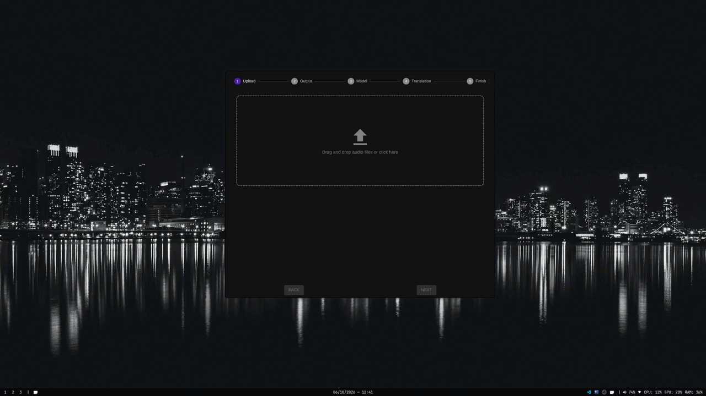
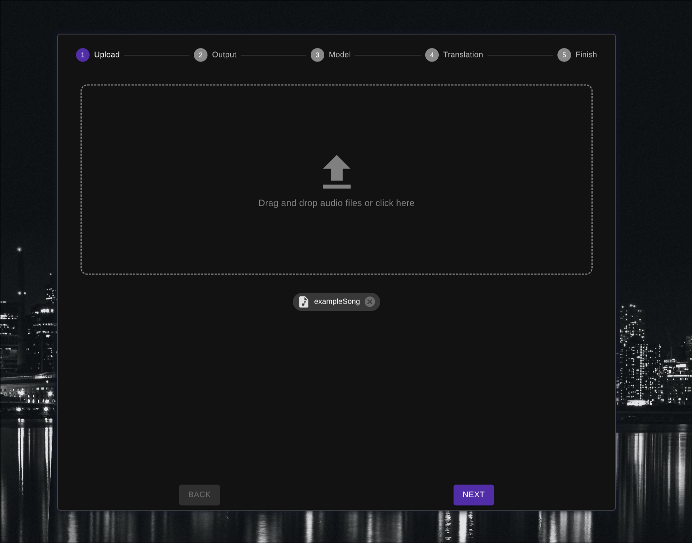
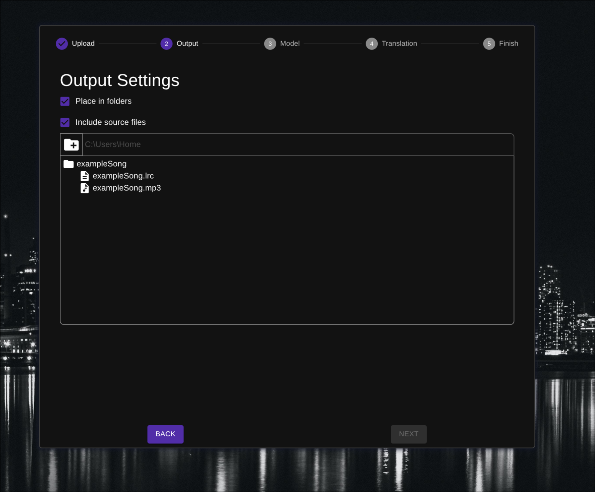
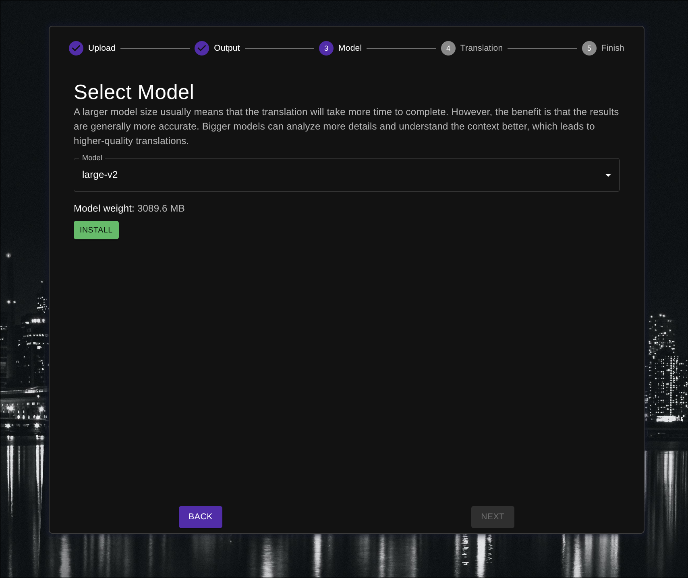
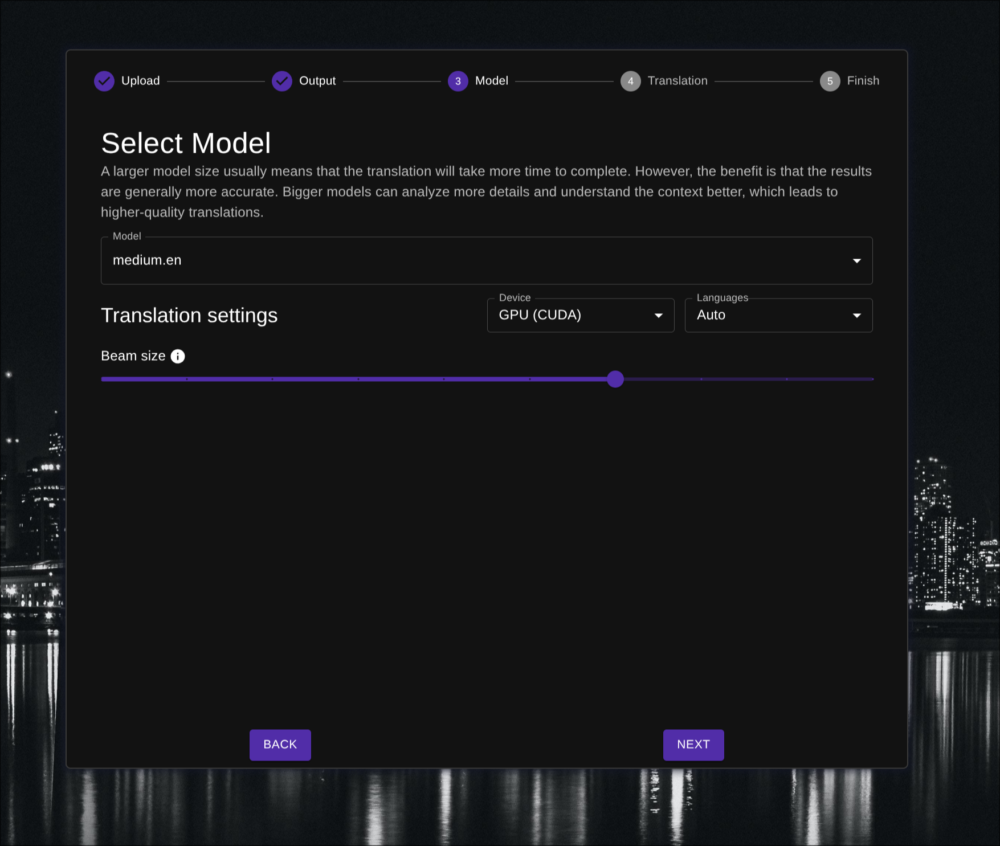
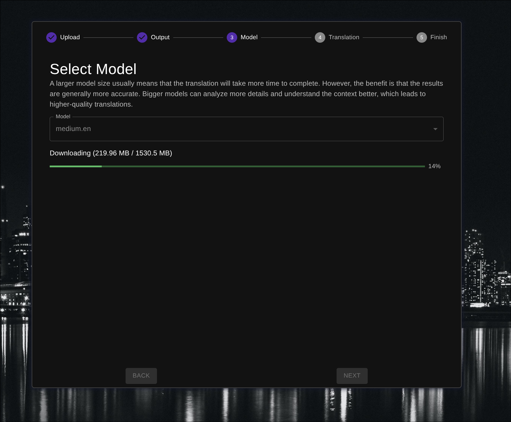
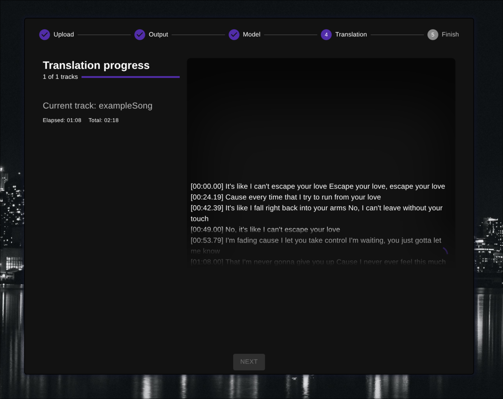
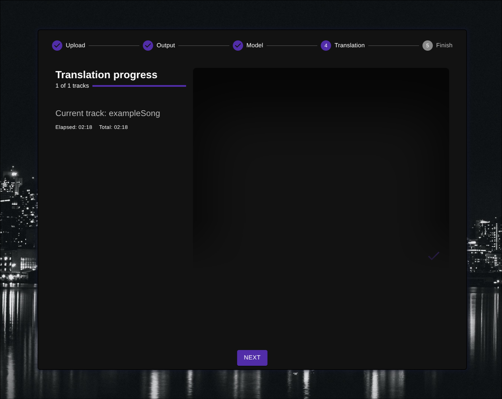
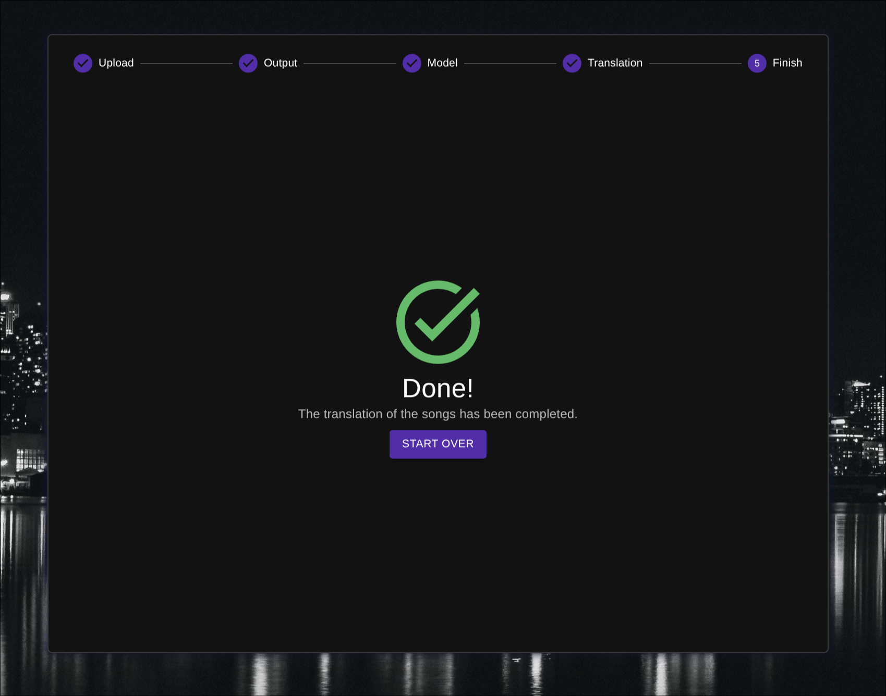
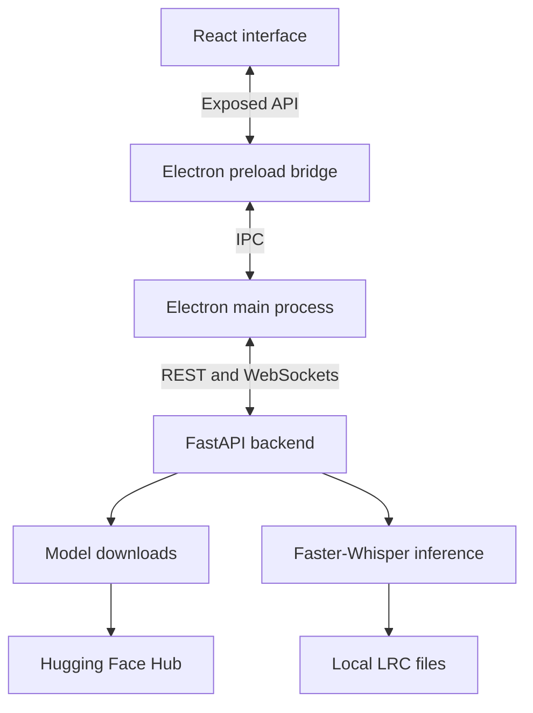

<div align="center">



# Lrcify

**An AI-powered desktop application for offline audio transcription and synchronized LRC lyric generation**

[](.github/assets/lrcify_video.mp4)


[](https://github.com/a-jadczak/lrcify/commits)
[](https://github.com/a-jadczak/lrcify)
[](https://github.com/a-jadczak/lrcify)

</div>

## 📋 Table of Contents

- [🎯 Overview](#-overview)
  - [❓ Problem](#-problem)
  - [💡 Solution](#-solution)
- [✨ Features](#-features)
- [🚀 Demo](#-demo)
- [🖼️ Screenshots](#️-screenshots)
- [🛠️ Tech Stack](#️-tech-stack)
  - [⚖️ Technical Decisions](#️-technical-decisions)
- [🏗️ Architecture](#️-architecture)
- [🧩 Challenges](#-challenges)
- [🏁 Getting Started](#-getting-started)
- [📖 Usage](#-usage)
- [🧪 Testing](#-testing)
- [📁 Project Structure](#-project-structure)
- [📄 License](#-license)

## 🎯 Overview

### **Lrcify is a desktop application for transcribing audio and generating timestamped lyrics in `.lrc` format.**

It guides users through selecting audio files, choosing an AI model, configuring inference settings, and exporting lyrics. Models can be downloaded directly within the application. Once the selected model is available locally, audio transcription runs entirely on the user's machine.

> **Work in progress:** Transcription quality and timestamp accuracy are still being refined. Results depend on the model, audio quality, background noise, and instrumental accompaniment. Generated lyrics may require manual corrections.

### ❓ Problem

Creating synchronized lyrics manually requires both transcribing the words and assigning timestamps to each line. This can be time-consuming, especially when working with multiple audio files. Users may also prefer to process their audio locally instead of uploading it to an online service.

### 💡 Solution

Lrcify combines local AI transcription with LRC export in a guided desktop workflow. Users can download a model, adjust processing settings to their hardware, and generate timestamped lyrics without uploading their audio for cloud processing.

## ✨ Features

### Guided workflow

A step-by-step interface walks users through audio selection, model configuration, output settings, and transcription.

### AI transcription and LRC generation

Use **Faster-Whisper** to transcribe audio and export the results as timestamped `.lrc` files.

### Drag-and-drop audio selection

Add audio files by dropping them into the application window.

### Integrated model manager

Browse and download models from the [Systran Faster-Whisper collection on Hugging Face](https://huggingface.co/collections/Systran/faster-whisper), with download progress displayed in the interface.

### Local-first processing

After downloading a model, run transcription offline on your own computer. Audio processing and AI inference take place locally.

### Configurable inference

Choose **CPU** or **CUDA** processing, adjust the **beam size**, and select a transcription language or use automatic language detection. CUDA processing requires a compatible NVIDIA GPU and runtime dependencies.

### Flexible output locations

Save generated lyrics alongside the source audio or in a dedicated output directory.

### Live progress updates

Track model downloads and preview timestamped transcription results as they arrive through WebSocket updates.

## 🚀 Demo

Watch the application workflow:

### [▶ Watch Demo](.github/assets/lrcify_video.mp4)

> This is a video demonstration. To run the application locally, follow the setup instructions in the [Getting started section](#-getting-started).

## 🖼️ Screenshots

<table>
  <tr>
    <td></td>
    <td></td>
  </tr>
  <tr>
    <td></td>
    <td></td>
  </tr>
  <tr>
    <td></td>
    <td></td>
  </tr>
  <tr>
    <td></td>
    <td></td>
  </tr>
</table>

## 🛠️ Tech Stack

| Category            | Technologies                           |
| ------------------- | -------------------------------------- |
| **Desktop**         | `Electron`                             |
| **Frontend**        | `React` · `TypeScript` · `Material UI` |
| **Backend**         | `Python` · `FastAPI` · `Uvicorn`       |
| **AI inference**    | `Faster-Whisper`                       |
| **Communication**   | `REST API` · `WebSockets`              |
| **Backend testing** | `pytest` · `FastAPI TestClient`        |
| **Tooling**         | `Vite` · `ESLint` · `Prettier`         |

### ⚖️ Technical Decisions

<details>
<summary><strong>Why Electron?</strong></summary>

<br>

Electron provides a desktop interface for running AI transcription locally. The long-term goal is to package the Electron app and Python backend together as a standalone application, so users can download it and run it without setting up the backend separately.

</details>

<details>
<summary><strong>Why a separate Python backend?</strong></summary>

<br>

The Python backend handles model management and Faster-Whisper API. FastAPI exposes these capabilities to the desktop application.

</details>

<details>
<summary><strong>Why WebSockets?</strong></summary>

<br>

WebSockets allow the backend to push model download progress and transcription results to the interface in real time, without repeated polling.

</details>

<details>
<summary><strong>Why local transcription?</strong></summary>

<br>

Local transcription lets users download models directly from the internet, avoiding server-side processing fee.

</details>

## 🏗️ Architecture

The application combines an Electron desktop interface with a local Python backend service:



- The **renderer** displays workflow steps, configuration controls, and progress.
- The **preload bridge** exposes APIs used by the renderer to access desktop functionality.
- The **main process** handles communication with the backend.
- The **Python backend** manages models, runs transcription, and generates output files.
- **WebSocket events** carry incremental download and transcription updates back to the interface.

## 🧩 Challenges

### Displaying accurate download progress

The Hugging Face download API I initially used did not provide the byte-level progress updates needed for the interface. The available approach tracked completed files, but each model consisted of several small files and one much larger file, sometimes reaching 2 GB. As a result, the progress indicator could remain unchanged for a long time while the largest file was still downloading, making the application appear stuck.
To provide more consistent feedback, I implemented streaming downloads and processed the data in small chunks. This allowed progress to be calculated from the number of bytes downloaded rather than the number of completed files.

### Detecting incomplete or corrupted downloads

An application crash or a lost internet connection can leave a partially downloaded model file on disk. To avoid treating these files as complete, I implemented hash-based integrity checks, comparing the downloaded file’s hash with the expected hash provided by Hugging Face API.
A matching hash confirms that the downloaded file matches the expected contents. A mismatch indicates that the file is incomplete, corrupted, or otherwise different from the expected version.

## 🏁 Getting Started

### 📋 Requirements

| Requirement         | Notes                                                          |
| ------------------- | -------------------------------------------------------------- |
| Node.js and npm     | Required for the Electron/React application                    |
| Python and pip      | Required for the FastAPI backend and inference dependencies    |
| Internet connection | Required to install dependencies and download models           |
| Local storage       | Space for dependencies, downloaded models, and generated files |
| NVIDIA GPU          | Optional; required only for CUDA inference                     |

> The current Python requirements pin `torch==2.9.1+cu126`. The installation command below preserves the repository's CUDA 12.6 package index. Availability depends on the Python version and platform; other environments may require a compatible PyTorch dependency configuration.

### 📦 Installation

**1. Clone the repository and enter its directory**

```bash
git clone https://github.com/a-jadczak/lrcify.git
cd lrcify
```

**2. Install desktop application dependencies**

```bash
npm install
```

**3. Create a Python virtual environment**

```bash
cd python
python -m venv venv
```

**4. Activate the virtual environment**

Windows Command Prompt:

```bat
venv\Scripts\activate
```

macOS / Linux:

```bash
source venv/bin/activate
```

**5. Install backend dependencies**

```bash
python -m pip install -r requirements.txt --extra-index-url https://download.pytorch.org/whl/cu126
```

### 💻 Development

In the `python/` directory, with the virtual environment active, start the backend:

```bash
python -m uvicorn app.main:app
```

Open a **second terminal in the repository root** and start the desktop application:

```bash
npm run dev
```

Keep both processes running while using the application.

### 🏭 Production Build

Build the Electron application:

```bash
npm run build
```

The repository also defines platform-specific packaging commands:

| Command               | Target  |
| --------------------- | ------- |
| `npm run build:win`   | Windows |
| `npm run build:mac`   | macOS   |
| `npm run build:linux` | Linux   |

> These scripts describe the Electron build and packaging workflow. A complete standalone distribution also needs the Python backend and its runtime dependencies; packaging the desktop shell alone does not establish that setup.

## 📖 Usage

1. Add your audio files using the file selector or drag and drop.
2. Select the destination path and choose whether to save lyrics alongside the source files or in a custom output directory
3. Select an AI model and download it if it is not installed locally.
4. Choose CPU or CUDA processing, set the beam size, and select a language or automatic detection.
5. Start transcription and follow the live progress and timestamped text preview.
6. Open the generated `.lrc` files and review the lyrics and timing.

## 📁 Project Structure

```text
lrcify/
├── resources/                  # Desktop application assets
├── src/
│   ├── main/
│   │   ├── config/             # Application window configuration
│   │   ├── ipc/                # Backend communication and native file dialogs
│   │   └── index.ts            # Electron application entry point
│   ├── preload/                # IPC bridge exposed to the React interface
│   ├── renderer/
│   │   └── src/
│   │       ├── components/     # Shared interface components
│   │       ├── contexts/       # Shared React state and providers
│   │       ├── pages/          # Workflow screens and their components and hooks
│   │       ├── styles/         # Global styles
│   │       ├── theme/          # Material UI theme
│   │       ├── utils/          # Renderer utilities
│   │       ├── App.tsx         # Application layout and providers
│   │       └── main.tsx        # React entry point
│   ├── ipc/                    # Shared IPC channel names
│   └── types/                  # Shared TypeScript types
├── python/
│   ├── app/
│   │   ├── api/                # REST endpoints and WebSocket handlers
│   │   ├── services/           # Model downloads, transcription, and LRC generation
│   │   ├── schemas/            # Request data models and validation
│   │   ├── helpers/            # Model caching, metadata, and path helpers
│   │   ├── utils/              # Shared backend utilities
│   │   └── main.py             # FastAPI application entry point
│   ├── tests/                  # Backend API tests
│   └── requirements.txt        # Python dependencies
├── electron.vite.config.ts     # Main, preload, and renderer build configuration
└── electron-builder.yml        # Desktop packaging configuration
```

## 📄 License

This project is licensed under the [MIT License](./LICENSE).

<div align="center">

**[⬆ Back to top](#lrcify)**

</div>
